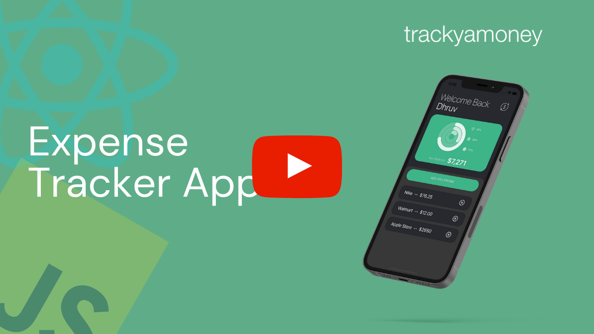

# Trackyamoney (Expense Tracker App)

This app is a very simple expense tracker app. It is an app with very basic functionality. It uses redux to change the balance value and props to display the expense items. I hope to continue working on perfecting this app in the future but for now, this is a very basic version.

  
  
^ Click to see demo ^

  
  
  
  

